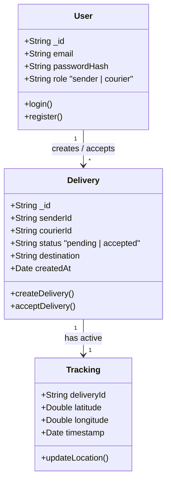
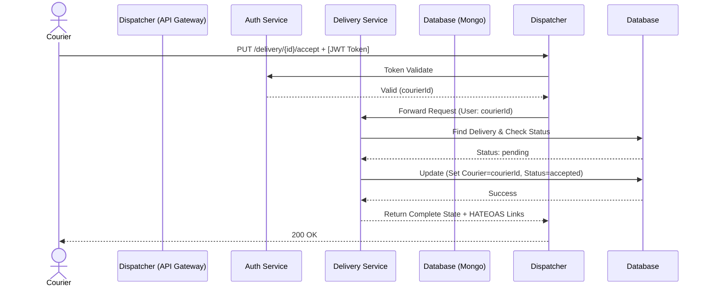
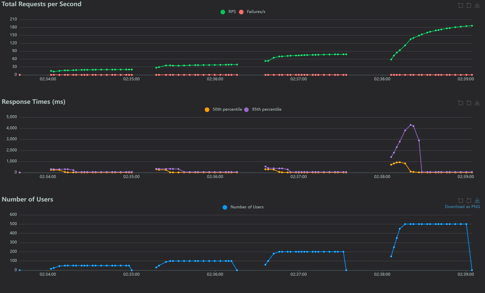
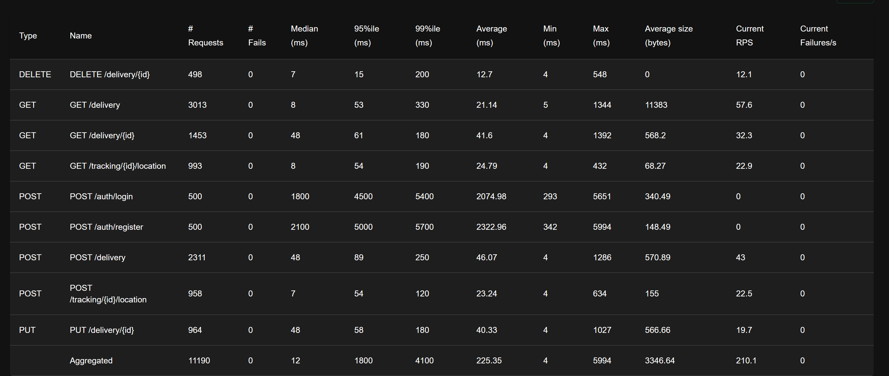

# Meridian-Dispatcher

## 1️⃣ Proje Bilgileri
- **Proje Adı:** Meridian-Dispatcher
- **Ekip Üyeleri:** Ali Buğra Eroğlu, Enes Şenyurt
- **Tarih:** 5 Nisan 2026

## 2️⃣ Giriş

### Problemin Tanımı
Günümüzde e-ticaret ve kargo süreçlerinin büyümesiyle birlikte kurye-teslimat eşleştirme operasyonlarındaki anlık yük muazzam boyutlara ulaşmıştır. Geleneksel monolitik sistemler, binlerce kullanıcının eşzamanlı olarak ilan açması ve kuryelerin bu ilanları anlık olarak görüp hızla kabul etmeye çalışması (race condition) senaryosunda kilitlenmekte veya darboğazlara yol açmaktadır.

### Projenin Amacı
**Meridian-Dispatcher** projesinin amacı, **"Aktif Teslimat İlanlarının Anlık Olarak Listelenmesi ve Kuryeler Tarafından Kabul Edilmesi"** senaryosunu mikroservis tabanlı izole bir mimari ile çözmektir. Bu yaklaşım, sistemin yüksek trafikli eşzamanlı istekler altında bile kesintisiz, dağıtık ve yüksek performansla çalışmasını sağlayarak kilitlenme olmadan kurye atamasını en optimize şekilde gerçekleştirmeyi hedefler.

## 3️⃣ Projenin Tasarımı ve Analizi

### 3.1 Literatür İncelemesi
Mikroservis mimarileri üzerine yapılan çalışmalar, monolitik yapılara kıyasla modüllerin birbirinden izole edilerek yatay eksende bağımsız ölçeklendirilebilmesini (horizontal scaling) sağladığını vurgulamaktadır (örn. Newman, 2015 "Building Microservices"). Ayrıca dış dünyaya kapalı iç ağ servislerinin bir **API Gateway** üzerinden yönetilmesi sistem güvenliğini maksimize eder. NoSQL (MongoDB, Redis) çözümleri ise lokasyon gibi esnek ve I/O hızına ihtiyaç duyan süreçlerin darboğaz oluşturmasını engellemekte etkin bir yöntem olarak literatürde öne çıkmaktadır.

### 3.2 Restful Servisler ve Richardson Olgunluk Modeli
REST (Representational State Transfer), istemci ile sunucu arasında veri aktarımını standartlayan bir mimari stildir. Bu projede mikroservisler, **Richardson Olgunluk Modeli (Richardson Maturity Model)** baz alınarak geliştirilmiştir.
- **Seviye 0-1:** URL içinde parametre (query string) ile state değiştiren yapı tamamen **kaldırılmış**, her bir kaynak salt kendi URI'si (örn: `/deliveries`) ile tanımlanmıştır.
- **Seviye 2 (HTTP Metotları):** İşlemler tamamen standartlara uygun olarak HTTP fiilleriyle (GET, POST, PUT, DELETE) ve uygun durum kodlarıyla (200 OK, 201 Created) eşleştirilmiştir.
- **Seviye 3 (HATEOAS):** İsteklere dönen yanıtlara (JSON) yalnızca veriler değil; istemcinin o durumdan sonra gidebileceği eylem linkleri de eklenerek (örn: *accept_delivery* aksiyon yönlendirmesi) tam bir HATEOAS entegrasyonu hedeflenmiştir.

### 3.3 Sınıf (Class) Yapıları ve Modeli
Servislerdeki veri şemaları (Schema), NoSQL (MongoDB/Redis) doğasına uygun olan sınıflardan oluşturulmuştur. 



### 3.4 Akış Diyagramı (Flowchart)
Yeni bir teslimat eklendikten sonra kuryenin bunu listelemesi, kabul etmesi ve sürecin başlamasıyla ilgili temel iş mantığı şeması:

```mermaid
flowchart TD
    A([Gönderici Giriş Yapar]) --> B{Token Geçerli mi?}
    B -- Hayır --> C([Yetki Yok Hatası Dön])
    B -- Evet --> D[Teslimat İlanı Oluştur POST /delivery]
    D --> E[(MongoDB'ye Yazılır)]
    E --> F([Kuryeler İlanları Listeler GET /delivery])
    F --> G[Kurye İlanı Kabul Eder PUT /delivery/id]
    G --> H{İlan Hala Aktif ve Beklemede (Pending) mi?}
    H -- Hayır --> I([Reddet - Başkası Kabul Etmiş])
    H -- Evet --> J[Status = Accepted Olarak Güncellenir]
    J --> K([Tracking / Takip Süreci Başlatılır])
```

### 3.5 Sequence (Sıralama) Diyagramı
Dispatcher (Gateway) üzerinden geçen yetkili bir teslimatı kabul etme sürecinin (Accept Delivery) modüller arası haberleşme adımları aşağıdaki gibidir:



### 3.6 Algoritmalar ve Karmaşıklık Analizi (Complexity Analysis)
**1. Gönderi Listeleme (Listing - GET /delivery):**
Teslimatları filtrelerken arka plandaki arama yükü:
- **Zaman Karmaşıklığı (Time Complexity):** İlgili veritabanı alanı (`status`) indexli (dizinlenmiş) olduğunda, veri çekmek logaritmik olan **O(log N) + K** (N: kayıt sayısı, K: sayfalama adedi) hızındadır.
- **Uzamsal Karmaşıklık (Space Complexity):** Bellekte sadece dönülen dökümanların referansı tutulduğundan bağıntı **O(K)** sabittir.

**2. Rekabetçi Teslimat Kabulü (Race Condition Control - PUT):**
Çift kuryenin aynı ilan için eşzamanlı istek atması sorunu (Concurrency) Optimistic Locking veya Atomic Updates (`findOneAndUpdate` with constraint) ile çözülür. Algoritma, okuduğu sırada güncellemeyi de şartlı yapar.
- **Zaman Karmaşıklığı:** Hash-Index yapısından (B-Tree vb.) yararlanıldığı için işlemler ortalamada **O(1)** sabittir. 


## 4️⃣ Projenin Modülleri ve Mimari Gösterim

Projenin altyapısı, tüm mikroservisleri dış dünyadan gizleyen kapalı bir iç ağ yapısı (Network Isolation) üzerine konumlandırılmıştır. Açık internetten gelen çağrılar yalnızca API Gateway tarafından karşılanır.

### 4.1 Modüllerin İşlevleri
1. **Dispatcher (API Gateway):** Sistemin giriş noktası, orkestra şefi ve reverse-proxy modülüdür. Yük dengelemesini (load balancing) yapar, token onaylarını yetkili servise iletir ve arka plandaki mikroservislerin yerlerini bilir.
2. **Auth Service:** Siber güvenlik, token (JWT) üretim - validasyon operasyonlarını ve kullanıcı yönetimi işlemlerini kendi döküman veritabanında gerçekleştirir.
3. **Delivery Service:** İlan yayınlama ile sistemin en yoğun olan kurye eşleşme süreçlerini (CRUD) kontrol eden teslimat ana modülüdür.
4. **Tracking Service:** Aktif teslimat süreçlerinde anlık paket ile kurye izleme faaliyetlerini (lokasyon akışlarını) yürütür. Bu aşamada performans için I/O hızı yüksek Redis mimarileri tetiklenir.

### 4.2 Sistem Mimarisi Modül Diyagramı

Mimarinin fonksiyonları ve modüllerin yapısal güvenliği aşağıdaki **Mermaid** diyagramında gösterilmiştir.

```mermaid
graph TD
    Client((Mobil/Web İstemci \n Gönderici & Kurye)) -->|Tüm İstekler| Dispatcher

    subgraph "Dış Dünyaya Kapalı (Network Isolation) İç Ağ"
        Dispatcher{Dispatcher \n API Gateway}
        
        Auth[Auth Service \n (Yetkilendirme)]
        Delivery[Delivery Service \n (Teslimat İşlemleri)]
        Tracking[Tracking Service \n (Konum Servisi)]

        Dispatcher -.->|JSON / REST| Auth
        Dispatcher -.->|JSON / REST| Delivery
        Dispatcher -.->|JSON / REST| Tracking
    end

    subgraph "İzole Her Servise Özel Veri Tabanları"
        DB_Disp[(Redis \n API Caching & Log)]
        DB_Auth[(MongoDB \n Kullanıcılar)]
        DB_Del[(MongoDB \n Teslimatlar)]
        DB_Track[(Redis \n Lokasyonlar)]
    end

    Dispatcher --> DB_Disp
    Auth --> DB_Auth
    Delivery --> DB_Del
    Tracking --> DB_Track

    subgraph "Monitoring & Analitik"
        Monitoring[Prometheus / Grafana]
        Monitoring -.->|Metric Reading| Dispatcher
    end
```


## 5️⃣ Uygulama

### 5.1 Ağ İzolasyonu (Network Isolation) Doğrulaması
Mimarinin temel gereksinimi olan "Dış dünyaya sadece Dispatcher açık olmalı" kuralı test edilmiş, istemcilerin `auth-service` veya `delivery-service` gibi iç servislere doğrudan erişimi engellenerek `Connection refused` dönmesi Docker Compose ağ kuralları ile kontrol altına alınmıştır.

### 5.2 Test Senaryoları ve Yük Testi (Performance Testing)
Sistemin yoğun trafik altındaki davranışını ölçmek amacıyla **Locust** aracı ile performans ve stres testleri gerçekleştirilmiştir. Test sırasında aşamalı olarak **500 eşzamanlı kurye ve gönderici (Concurrent Users)** simüle edilmiştir. 

Sistem üzerinde gerçekleştirilen senaryolar:
1. `POST /auth/register` ve `POST /auth/login` işlemleri ile hesap oluşturma ve sisteme giriş reaksiyonları,
2. `POST`, `GET`, `PUT`, `DELETE /delivery` süreçleri ile teslimat ilanlarının gönderilmesi, listelenmesi ve güncellenmesi,
3. `POST`, `GET /tracking/{id}/location` süreçleri ile anlık konum takip sisteminin yüksek kullanıcı sayısındaki stabilitesi ölçülmüştür.

### 5.3 Ekran Görüntüleri ve Test Sonuçları
Toplamda test boyunca yaratılan **11.190 adet istek** API Gateway (Dispatcher) üzerinden iç servislere ve ardından izole MongoDB veritabanlarına ulaştırılmış, sistem dışarıdan gelen bu çoklu taleplere **0 hata (%100 başarı)** ile yanıt vermiştir. 



*(Saniyede yapılan istek (RPS), yanıt süreleri ve 500 aktif kullanıcıya kadar giden artışı gösteren grafik)*


*(Uygulamanın uç nokta analizleri, medyan ve 95. yüzdelik gecikme değerlerini gösteren performans tablosu)*

**Performans Çıktıları:**
- **Ortalama RPS (Request Per Second):** Saniyede ortalama **210.1** istek işlenmiş olup, bu yükler esnasında darboğaz görülmemiştir.
- **Delivery ve Tracking Hızları:** Veritabanı ve Redis işlemlerinin yoğun olduğu kurye eşleşme süreçlerinde (`POST /delivery`, `PUT /delivery/{id}` vb.) medyan yanıt süresi **48 ms**, veri çekme ve konum listeleme/yazma süreleri ise **7-8 ms** gibi iyi bir seviyededir. Tracking konum bazlı güncellemeler 95. yüzdelik (%95ile) puanda bile **54 ms**'yi geçmemiştir.
- **İstisnalar (Auth Darboğazı):** Kullanıcı Kaydı (`POST /auth/register`) ve Giriş (`POST /auth/login`) işlemlerinin medyan süreleri, şifreleme (hash) algoritmalarının maliyetleri ve veri tabanına ilk yazım (insert) işlemleri sebebiyle sırasıyla ortalama **2100 ms** ve **1800 ms** cıvarında gerçekleşmiştir.

---

## 6️⃣ Sonuç ve Tartışma

### Başarılar
1. **Güçlü Mimari İzolasyon:** 500 anlık kullanıcılı stres testine maruz bırakıldığında bile tüm servis haberleşmesi `Dispatcher` gateway üstünden geçmiş, izole ağ tasarımı başarılı biçimde çalışmıştır. Toplamda **0 Request Fail** durumu görülmektedir.
2. **İyi Teslimat ve Takip Hızı:** Dispatcher'ın yükü devrettiği `Delivery` ve `Tracking` modüllerinin anlık veri işleme yetenekleri oldukça başarılı görünmektedir. Sistemi ayakta tutacak hedeflenen konum ve süreç güncelleme operasyonlarına optimal bir süre ile ulaşılmıştır.

### Sınırlılıklar
1. **Authentication Darboğazı:** Test istatistiklerine detaylı bakıldığında, sistem kaynaklarının sınırlarını zorlayan en büyük unsur `auth-service` olmuştur. `POST /auth/register` ve `POST /auth/login` işlemlerinde 95. yüzdelik (%95ile) cevap süresinin **4500 - 5500 ms**'lere (4-5 saniye) fırladığı görülmektedir. Parola hashleme maliyetleri ve ilk oturum süreçlerindeki iş yükü eşzamanlılığı geç yanıtlamaktadır.

### Olası Geliştirmeler
1. **Yatay Ölçeklendirme :** Auth servisinin yoğun stres altında yaşattığı cevap gecikmesi bariyerini aşmak için, Docker Compose üzerinde `auth-service` replica katsayısı arttırılarak talepleri yatayda parçalayan birden çok container ayağa kaldırılabilir.
2. **Redis Caching Desteği:** Teslimat (`GET /delivery`) listelemelerinin her istekte yoğun biçimde MongoDB veritabanına gitmesi yerine, Dispatcher katmanında veya kendi içinde Redis Cache ile tamponlanarak, daha büyük ölçekli yükler için koruyucu önlemler alınabilir.
3. **Message Queue Asenkronizasyonu:** İlerleyen safhalarda RabbitMQ veya Kafka eklentisiyle, yoğun yük gerektiren kayıt işleme ve log yazma aşamaları sisteme ağırlık yapmayacak şekilde tamamen arka plana itilip asenkron mimariye evrilebilir.