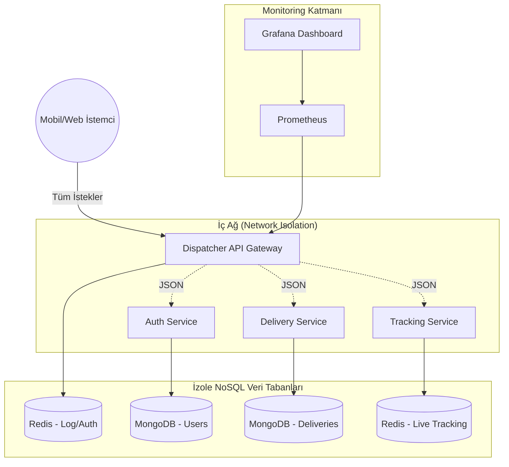

# Meridian-Dispatcher

## 1️⃣ Proje Bilgileri
- **Proje Adı:** Meridian-Dispatcher
- **Ekip Üyeleri:** [Ekip Üyelerinin İsimleri]
- **Tarih:** 16 Mart 2026

## 2️⃣ Giriş

### Problem Tanımı ve Amaç (Faz 1: Senaryo Belirleme)
Meridian-Dispatcher uygulamasında yoğun trafiğe maruz kalacak temel senaryo: **"Aktif Teslimat İlanlarının Anlık Olarak Listelenmesi ve Kuryeler Tarafından Kabul Edilmesi"** olarak belirlenmiştir. Yüzlerce kullanıcının aynı anda paket göndermek için ilan açtığı ve kuryelerin bu ilanlara aynı anda talip olduğu bir durum simüle edilmektedir.

Sistem en az 4 bağımsız üniteden oluşmaktadır:
* **Dispatcher (API Gateway):** Sistemin tek giriş noktası ve yetkilendirme merkezi.
* **Auth Service (Oturum Açma):** Kullanıcı (gönderici/kurye) kayıt ve giriş işlemlerini yönetir.
* **Delivery Service:** Teslimat ilanlarının oluşturulması ve listelenmesi.
* **Tracking Service:** Kabul edilen paketlerin kurye üzerindeki anlık durum takibi.

## 3️⃣ Sistem Tasarımı

### Mikroservis Mimarisi ve Docker Compose Taslağı
Tüm yapının tek bir `docker-compose up` komutuyla ayağa kalkması hedeflenmiştir. İç ağı (internal network) korumak için sadece Dispatcher ve Grafana dışarıya port açmaktadır.

```yaml
version: '3.8'

services:
  dispatcher:
    build: ./dispatcher
    ports:
      - "8080:8080" # Sadece bu servis dış dünyaya açık
    networks:
      - meridian_network
    depends_on:
      - auth-service
      - delivery-service

  auth-service:
    build: ./auth_service
    networks:
      - meridian_network # Dışarıya kapalı, port yönlendirmesi yok
    depends_on:
      - mongo-auth

  delivery-service:
    build: ./delivery_service
    networks:
      - meridian_network
    depends_on:
      - mongo-delivery

  mongo-auth:
    image: mongo
    networks:
      - meridian_network

  mongo-delivery:
    image: mongo
    networks:
      - meridian_network

  grafana:
    image: grafana/grafana
    ports:
      - "3000:3000" # Arayüz için dışarıya açık
    networks:
      - meridian_network

networks:
  meridian_network:
    driver: bridge
```

### REST Servisleri ve Richardson Maturity Model (Faz 1: API Kontratları)
URL içinde parametre kullanmak kesinlikle yasaktır (Örn: `?id=1`); kaynaklar sadece URI üzerinden tanımlanmıştır. Projede HATEOAS (Seviye 3) yaklaşımı hedeflenerek tasarlanmıştır.

**Delivery Service Örnek Kontratı:**
* `POST /deliveries`: Yeni bir teslimat ilanı oluşturur. (Başarılıysa HTTP 201 Created döner).
* `GET /deliveries`: Aktif ilanları listeler. (HTTP 200 OK).
* `GET /deliveries/{id}`: Belirli bir ilanın detayını getirir.
* `PUT /deliveries/{id}`: İlanın durumunu günceller (Örn: kurye kabul etti).
* `DELETE /deliveries/{id}`: İlanı iptal eder.

*HATEOAS (Seviye 3) Bonus Örneği:* `GET /deliveries/123` isteği yapıldığında dönen JSON gövdesi, sadece veriyi değil, yapılabilecek sonraki aksiyonların linklerini de içerir:

```json
{
  "id": "123",
  "status": "pending",
  "destination": "Derince, Kocaeli",
  "links": [
    { "rel": "self", "href": "/deliveries/123", "method": "GET" },
    { "rel": "accept_delivery", "href": "/deliveries/123/accept", "method": "PUT" }
  ]
}
```

*Not: Sınıf diyagramları, sequence diyagramları ve algoritmalar ilerleyen fazlarda eklenecektir.*

## 4️⃣ Sistem Mimarisi

### Modüller, Bileşenler ve Mermaid Diyagramları (Faz 1: Sistem Mimarisi Diyagramı)
Aşağıdaki mimari diyagramı, mikroservislerin dış dünyaya kapalı (Network Isolation) ve her servisin kendi NoSQL veri tabanına sahip olduğu kuralını tam olarak yansıtmaktadır.



## 5️⃣ Uygulama
*(Ekran görüntüleri, test senaryoları ve yük testi süreçlerine dair sonuçlar uygulamanın geliştirme süreci ilerledikçe bu bölüme eklenecektir.)*

## 6️⃣ Sonuç
*(Başarılar, sınırlılıklar ve geliştirme önerileri projenin tamamlanmasıyla bu bölüme eklenecektir.)*